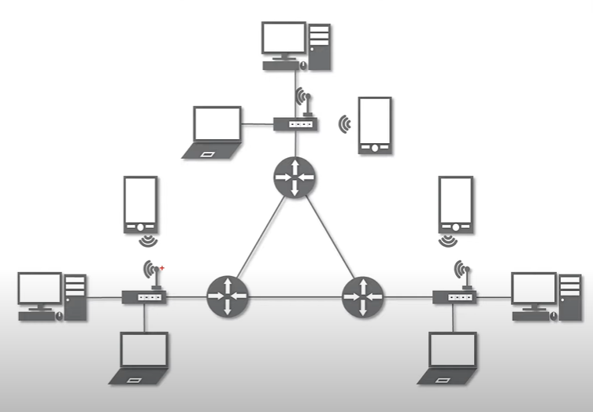
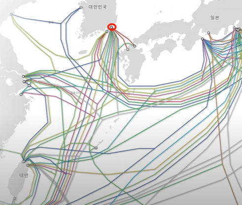

전체영상: [네트워크 기초(개정판)](https://www.youtube.com/playlist?list=PL0d8NnikouEWcF1jJueLdjRIC4HsUlULi)

# [네트워크란?](https://youtu.be/Av9UFzl_wis?list=PL0d8NnikouEWcF1jJueLdjRIC4HsUlULi)

***문서, 그림 영상과 같은 여러가지 데이터를 공유하도록 구성된 세상에서 가장 큰 전세계를 연결하는 "네트워크"***
> ### LAN(Local Area Network)
***가까운 지역을 하나로 묶은 "네트워크"***

> ### WAN(Wide Area Network)
***멀리 있는 지역을 한데 묶은 "네트워크"***
 
가까운 지역끼리 묶인 LAN과 LAN을 다시 하나로 묶은 것

## 연결 형태에 따른 분류
***Star, Mesh, Tree, 링, 버스, 혼합***

> ### Star형
***"중앙 장비"에 모든 노드가 연결***
 
중앙 장비가 고장나면 다 안됨

> ### Mesh형
***여러 노드들이 서로 "그물"처럼 연결***
 
하나가 고장나도 다른 연결을 통해 이동

> ### 혼합형
LAN는 Star형
 
WAN은 Mesh형
 

 

> ### 네트워크 통신 형식

### [실습1 (tracert)](https://youtu.be/paJf7JbBWqY?list=PL0d8NnikouEWcF1jJueLdjRIC4HsUlULi)

- 

### [실습2 (Wireshark)](https://youtu.be/vBrQ3yzerMg?list=PL0d8NnikouEWcF1jJueLdjRIC4HsUlULi)

- 

### [네트워크 모델](https://youtu.be/y9nlT52SAcg?list=PL0d8NnikouEWcF1jJueLdjRIC4HsUlULi)

-
